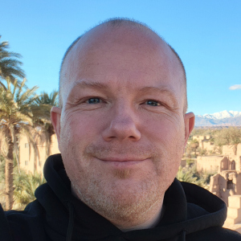

# Hans Christian "HC" Saustrup

## Introduktion

Linux-specialist med solid baggrund i softwareudvikling og
forkærlighed for automatisering, sikkerhed, cloud computing og
Kubernetes. Selvstændig siden 2008. Gift med Nina, og bor med deres to teenagere Thomas og Natasha i Lystrup, nord for Aarhus.

- Status: Til rådighed fra marts 2026
- Nøgleord: Linux, Kubernetes, Terraform, Go, Ansible
- Roller: Platformsingeniør, systemadministrator, tooling-udvikler
- Område: Primært østjylland, men mødemulighed over hele landet

## Erhvervserfaring

### Systematic A/S (2026)

- **Rolle**: Platformsingeniør, IKS, Group IT (Ekstern)
- **Ansvarsområde**: Konfidentielt
- **Resultater**: Konfidentielt
- **Teknologier**: Kubernetes, Go, Terraform, Terragrunt, Ansible, Linux

### Nuuday A/S (2022-2026)

- **Rolle**: Platformsingeniør, Cloud & Container Center of Excellence (Ekstern)
- **Ansvarsområder**: Design, implementation og drift af internt multi-cloud, multi-cluster, multi-tennancy Kubernetes offering baseret på Amazon EKS, Microsoft AKS og SUSEs Rancher til on-premise.
- **Resultater**: Konstruktion af solid Terraform-baseret orkestreringsstrategi. Alle clustre og alle standardkomponenter blev driftet og vedligeholdt af mit team. Vi har gennemført løbende opgraderinger af clustre og komponenter med oppetid meget nær 100%.
- **Teknologier**: Azure, AWS, Rancher, Terraform, Kubernetes, Cert-Manager, ExternalDNS, Prometheus, Loke, Grafana, Go, Git, Atlantis

### Nuuday A/S (2022)

- **Rolle**: Udvikler, OpenShift udviklingsplatform (Ekstern)
- **Ansvarsområder**: Design, implementation og deployment af OpenShift-baseret udviklingsplatform der understøtter Cell Based Service Architecture.
- **Resultater**: En løsning til udviklere, der nemt kunne orkestrere komplekse midlertidige udviklingsmiljøer med komponenter fra teams på tværs af organisationen, baseret på branches i Git.
- **Teknologier**: Azure, OpenShift, Go, Git

### Systematic A/S (2020)

- **Rolle**: Udvikler (Ekstern)
- **Ansvarsområde**: Kortvarig opgave med konsulentbistand til Health Care afdelingen i forbindelse med udvidelse af FHIR-baseret integration til understøttelse af Kerberos authentication.
- **Resultater**: Velfungerende kodeeksempler til Kerberos-integration.
- **Teknologier**: Java, Kerberos

### Salling Group A/S (2019-2020)

- **Rolle**: Site Reliability Engineer (Ekstern)
- **Ansvarsområder**: Hjælp til udviklere og DevOps team med migrering fra OpenShift 3.5 til 3.11. Design og forbedringer af container images til bygning og afvikling af Java microservice applikationer, samt images til andre infrastrukturkomponenter. Udvikling og vedligehold af Catapult – et værktøj skrevet i Java til at orkestrere projekter i OpenShift ved branching i Git. Udrulning af løsning til instrumentering og visualisering af microservice metrikker.
- **Resultater**: Successful migrering af OpenShift til 3.11. Forberedelse af OpenShift platform til ny microservice-baseret infrastruktur. Levering af værdifulde værktøjer til indblik i metrikker og logs.
- **Teknologier**: OpenShift, Java, Git (BitBucket/Gitlab), Prometheus, Grafana, ElasticSearch, Kibana

### Incredible Bits ApS (2020-)

- **Rolle**: Indehaver, udvikler, systemadministrator
- **Ansvarsområder**: Design og daglig drift af komponenter til egen virksomhed, bl.a. DNS, e-mail og pipelines til bygning af software. Drift af gratis services som Mastodon og Matrix.
- **Resultater**: Fungerende løsninger til daglig drift, samt laboratorieopstilling af Kubernetes-cluster.
- **Teknologier**: Kubermetes, Terraform, PowerDNS, DNSdist, Bind, Postfix, RSPAMD, Dovecot, OpenDKIM, Gitea/Forgejo/Gitlab/Github, Drone/Woodpecker-CI, Harbor, ArgoCD, Flux-CD, Ansible

### Danske Bank (2016-2019)

- **Rolle**: Platform Engineer, MobilePay IT (Ekstern)
- **Ansvarsområder**: Som del af et internationals co-located Platform Team var jeg ansvarlig for design, orkestrering, konfiguration og vedligehold af platformen, hvorpå backend-delen af MobilePay betalingsløsningen kørte.
- **Resultater**: Konstruktion af platforms-CMDB med tilhørende API, skift til Terraform som orkestreringsværktøj, udrulning af først InfluxDB og senere Prometheus til metrikindsamling, samt Grafana til visualisering og alarmering.
- **Teknologier**: C#, OpenShift, InfluxDB, Prometheus, Grafana, Terraform

### EnergiMidt (Eniig) (2016)

- **Rolle**: DevOps Engineer (Ekstern)
- **Ansvarsområde**: Opdatering, fejlsøgning og tilføjelse af funktionalitet til en multi-platform løsning til indsamling og behandling af målerdata fra elmålere. Opgradering og vedligehold af bygge- og applikationsservere.
- **Resultatet**: Mange fejl og mangler udbedret i både Java og C# kodebasen. Tredjepartsafhængigheder opdateret på tværs af alle projekter. Introducerede IT-afdelingen for konfigurationsstyring.
- **Teknologier**: Java, C#

### LEGO System A/S (2015)

- **Rolle**: Continuous Delivery Engineer (Ekstern)
- **Ansvarsområder**: Som del af System Teamet var jeg ansvarlig for vedligehold af bygge- og deploymentpipelines for LEGOs adskillige websites og mobilapps. Ligeledes ansvarlig for implementation af Kerberos-baseret single sign-on i de af teamet anvendte værktøjer. Daglig support af udviklere.
- **Resultater**: Tilføjelse af multi-arkitektur byggemiljø og pipelines i Electric Cloud. Introducering af ElasticSearch og Kibana til behandling af logdata. Introduktion af Gitlab som alternativ til proprietær kildekodeversioneringsværktøj.
- **Teknologier**: Electric Cloud, ElasticSearch, Kibana, Gitlab

### CodeCompany.dk ApS (2008-2015)

- **Rolle**: Udvikler, systemadministrator, partner
- **Ansvarsområder**: Design, specificering, tilbud, implementering og deployment af alle typer webløsninger fra relativt simple CMS-systemer til store og komplekse e-commerce sites med intregration til ERP-systemer.
- **Resultater**: Implementation og/eller forbedring af e-commerce sites for større danske virksomheder som IDEmøbler, Kop & Kande og Pilgrim. Design, implementering, drift og vedligehold af interne services som DNS og e-mail.
- **Teknologier**: Bl.a. Umbraco CMS, Magento, Synkron Via CMS, Varnish, C#, Java, PHP, PowerDNS, Bind, Postfix, Dovecot, SpamAssassin

## Uddannelse

- Datamatiker, Århus Købmandsskole (2000-1998)
- Informatikassistent, Århus Købmandsskole (1994-1997)

## Frivilligt arbejde

- Bestyrelsesmedlem, Delfinerne – spejderne i Skæring, Det Danske Spejderkops (2025-)
- Medhjælper, Smukfest, Skanderbord (2025-)
- Chauffør, Biler til Ukraine (2023-)

## Kontakt

- Telefon: [+45 3026 1024](tel:+4530261024)
- E-mail: [hc@incrediblebits.net](mailto:hc@incrediblebits.net?subject=Your%20CV%20on%20Github)
- Signal: [saustrup.64](https://signal.me/#eu/uSespIu-yjtkr3ccr8EVw119NYM5VoAgmKS7UZmZmjYCh94h0idDuqWDbW0VOTyJ)
- WhatsApp: [4530261026](https://wa.me/4530261024?text=I%20just%20saw%20your%20CV%20on%20Github)
- Telegram: [@hcsaustrup](https://t.me/hcsaustrup)
